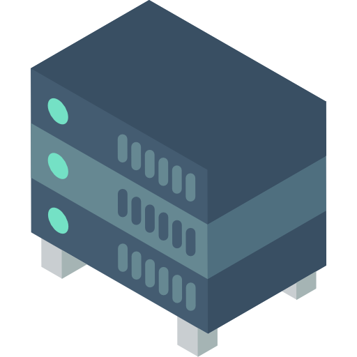

# Server Build



[Nas icons created by Smashicons - Flaticon](https://www.flaticon.com/free-icons/server)

## Table Of Contents

- [Server Build](#server-build)
  - [Table Of Contents](#table-of-contents)
  - [Description](#description)
  - [Access](#access)
  - [Getting Started](#getting-started)
  - [Documentations](#documentations)
  - [Development](#development)
    - [Requirements](#requirements)
    - [Docsify](#docsify)
  - [Contributing](#contributing)
  - [Licence](#licence)

## Description

How to build a server machine.

## Access

- **Development (Local)** :
  - [Server Build Docs Development](http://localhost:6007)
- **Production (Local)** :
  - [Server Build Docs Production](http://localhost:6007)
- **Production** :
  - [Server Build Docs Production](https://proginfra.gitlab.io/server_build)

## Getting Started

You have **several step** to build a new **server machine** :

1) First of all choose your [type of server](./docs/type.md).
2) Next depend of your money and your type of server, choose an [architecture of piece](./docs/architecture.md) for your server, buy it and build it.
3) Finally you can choose your server [Operating System](./docs/operating_system.md) and setup your server.
   1) [Basic System (In Progress)](TODO)
   2) [OpenMediaVault System (In Progress)](TODO)
   3) [TrueNAS System (In Progress)](TODO)
   4) [ProxMox System (In Progress)](TODO)

## Documentations

- [Ideas](./docs/ideas.md)
- [Type of Server](./docs/type.md)
- [Architecture of Piece](./docs/architecture.md)
- [Operating System](./docs/operating_system.md)

## Development

If you want you can **develop** this repository :

1) You need to install the [Requirements](#requirements)
2) You can develop on [Docsify](#docsify)

### Requirements

We use **Docker** :

- Docker
- Docker Compose

### Docsify

```bash
cd docsify

# Development
docker-compose -f docker-compose.dev.yml up

# Production
docker-compose up --build
```

## Contributing

See [CONTRIBUTING](./CONTRIBUTING.md) for more information.

## Licence

This project is licensed under the terms of the MIT license.

See [LICENSE](./LICENCE.md) for more information.
